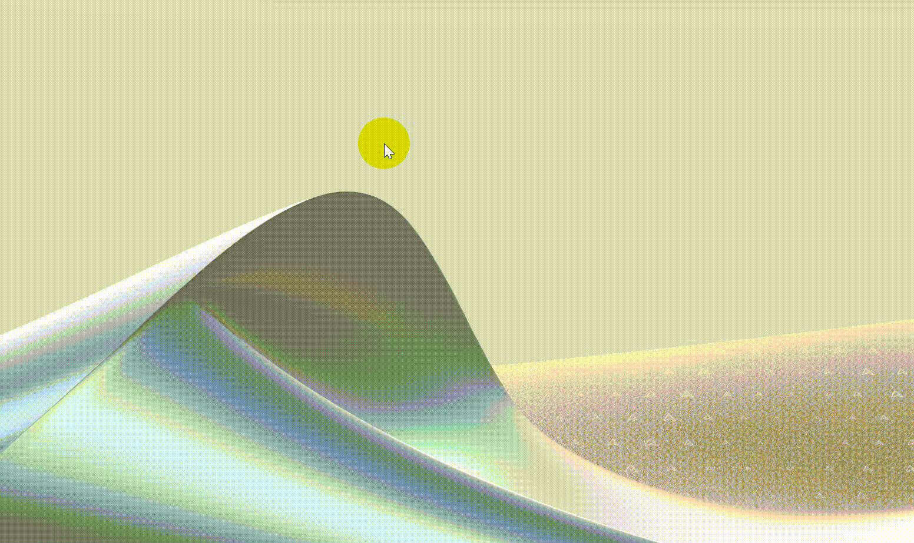

# Інтерактивна 2D-симуляція динамічного дощу (C++ / WinAPI / GDI)

Легковажний кросплатформний 2D-додаток інтерактивної графіки, створений мовою C++ з використанням чистого Windows API та інтерфейсу графічних пристроїв GDI (Graphics Device Interface).

Проект демонструє низькорівневе системне програмування, ручне керування архітектурою пам'яті Windows, власні фізичні цикли та подвійну буферизацію рендерингу для підтримки стабільних 60 FPS.

## 🚀 Технічні особливості
* **Чистий WinAPI:** Повна відсутність сторонніх движків (як-от Unity чи Unreal) або важких фреймворків. Робота з низькорівневою реєстрацією `WNDCLASS`, циклом обробки повідомлень та колбеками `WndProc`.
* **Рендеринг із подвійною буферизацією:** Використання сумісних контекстів пристрою пам'яті (`CreateCompatibleDC`, `CreateCompatibleBitmap`) для повного усунення мерехтіння екрана та артефактів розриву кадру.
* **Власний фізичний рушій:** Реалізація векторних математичних обчислень швидкості крапель, перевірки колізій з перешкодами та псевдовипадкової генерації нових елементів.
* **Низькорівневе профілювання:** Додаток оптимізовано з точки зору використання оперативної пам'яті та налагоджено за допомогою аналізаторів виконання (OllyDbg).

## 🛠️ Стек технологій та інструменти
* **Мова:** C++ (стандарт C++17)
* **Графічний стек:** Win32 API, GDI (Graphics Device Interface)
* **Середовище розробки:** Microsoft Visual Studio
* **Аналіз та реверс-інжиніринг:** OllyDbg

## 📊 Демонстрація роботи

*Візуалізація плавного розтікання крапель дощу в інтерактивному графічному вікні.*

## 💾 Структура проекту
* `main.cpp` — точка входу в програму (`WinMain`), головний цикл рендерингу у реальному часі та обробники низькорівневого введення користувача.
* `Simulation.cpp` / `.h` — об'єктно-орієнтований рушій станів, що відповідає за вектори координат крапель, їхню генерацію та синхронізацію швидкості.
* `Renderer.cpp` — графічний конвеєр GDI, що малює вектори у системній пам'яті перед виведенням готового кадру на екран.

## 🛠️ Компіляція та запуск
1. Склонуйте репозиторій локально.
2. Відкрийте файл рішення (`.sln`) у **Microsoft Visual Studio**.
3. Виберіть конфігурацію **Release / x64** або **x86**.
4. Зберіть проект та запустіть виконуваний файл. *(Антивірус Windows SmartScreen може попередити про запуск самописного софту без цифрового підпису — натисніть «Докладніше -> Виконати в будь-якому випадку»)*.
